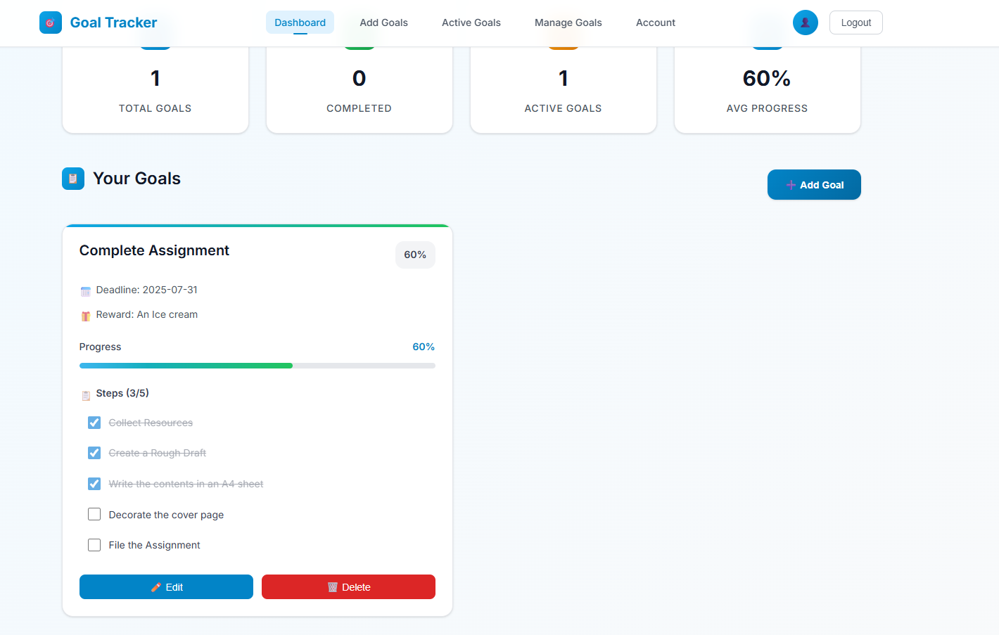
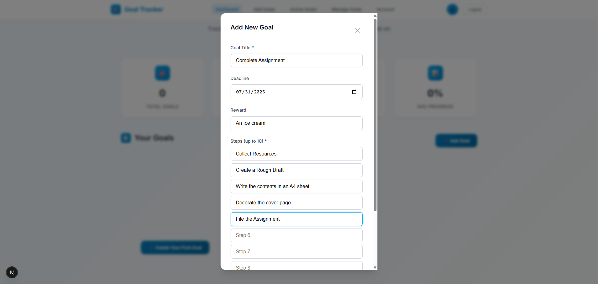
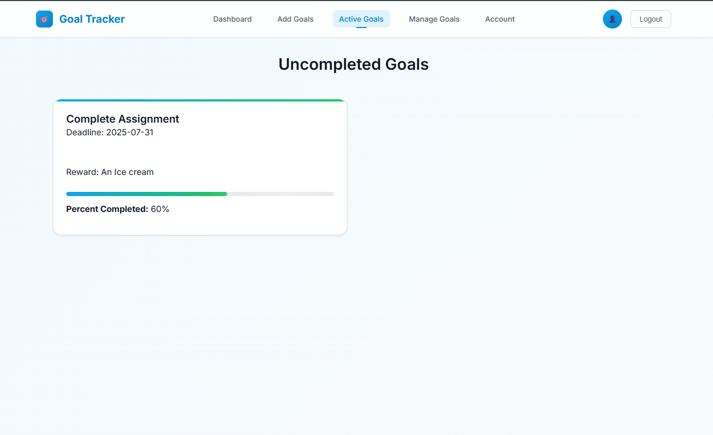
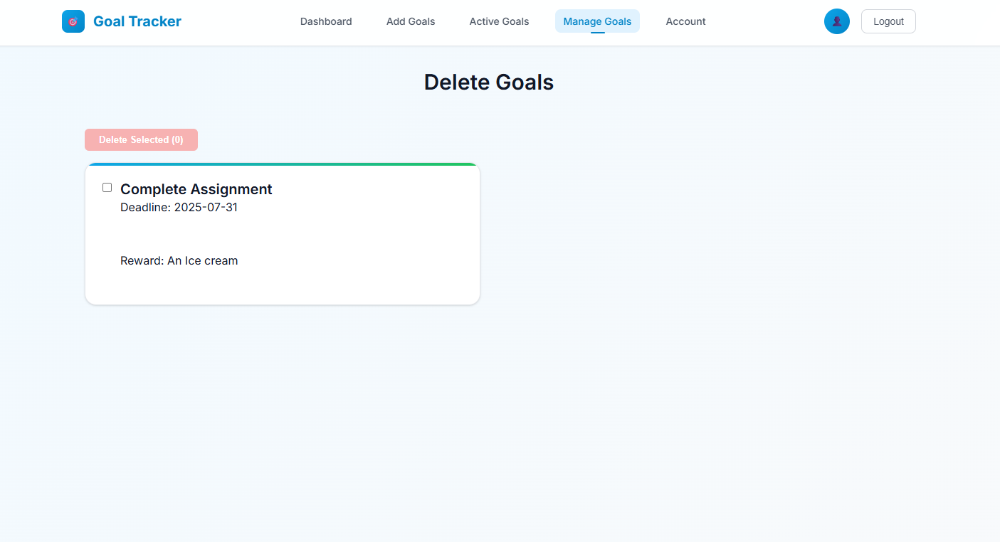
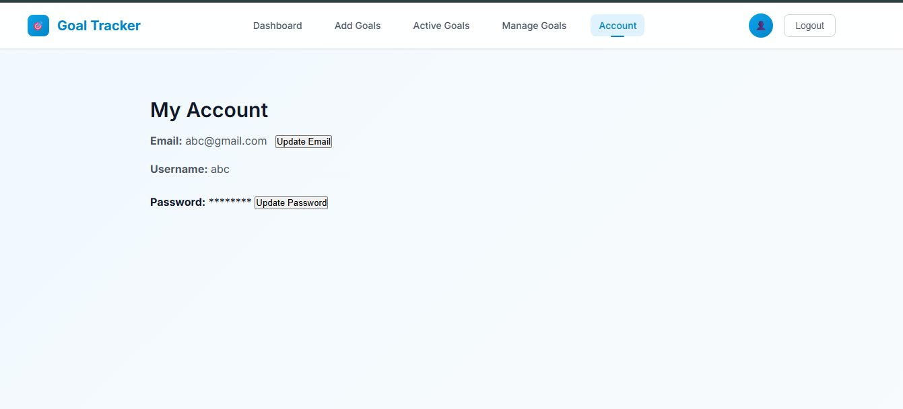

# Goal Tracker

A **professional and modern** goal tracking web application built with **Next.js (App Router, JavaScript only)** and **MongoDB (local, via Compass)**. This app features a stunning, enterprise-grade UI designed by experienced developers, with comprehensive goal management, progress tracking, and analytics dashboard.

---

## 📸 Screenshots

### Dashboard Overview

*Main dashboard with analytics cards showing goal statistics*

### Dashboard with Goals

*Dashboard populated with sample goals and progress tracking*

### Add Goals Interface

*Interface for creating new goals with step-by-step breakdown*

### Active Goals Management

*View and manage goals that are currently in progress*

### Goal Management

*Bulk goal management and deletion interface*

### User Account

*User account settings and profile management*

---

## 🚀 Features

### **Professional Dashboard**
- **Analytics Overview:** Real-time statistics with beautiful cards showing total goals, completed goals, active goals, and average progress
- **Modern UI/UX:** Sleek, responsive design with smooth animations, gradients, and professional color scheme
- **Progress Visualization:** Animated progress bars with shimmer effects and intuitive step tracking
- **Empty States:** Engaging empty states with call-to-action buttons

### **Goal Management**
- **Smart Goal Creation:** Add goals with title, deadline (calendar picker), reward, and up to 10 actionable steps
- **Progress Tracking:** Real-time progress calculation with visual indicators
- **Step Management:** Interactive checkboxes with completion states and visual feedback
- **Bulk Operations:** Select and manage multiple goals efficiently

---

## 🛠️ Tech Stack

- **Frontend:** Next.js 14 (App Router, JavaScript)
- **Backend/API:** Next.js API routes with RESTful endpoints
- **Database:** MongoDB (local, via Compass)
- **Styling:** SCSS Modules with CSS Variables and Design System
- **State Management:** React hooks with optimized re-renders
- **Typography:** Inter font family for professional readability
- **Icons:** Emoji-based icons for cross-platform compatibility

---

## 📁 Project Structure

```
goal-tracker/
├── app/
│   ├── components/         # Reusable UI components
│   │   ├── Navbar.js      # Professional navigation
│   │   └── Navbar.module.scss
│   ├── globals.css        # Design system & global styles
│   ├── layout.js          # Root layout with metadata
│   ├── page.js            # Main dashboard page
│   └── [other pages]/     # Feature-specific pages
├── styles/
│   └── Home.module.scss   # Dashboard styles
├── lib/
│   └── mongodb.js         # Database connection
├── models/
│   ├── Goal.js            # Goal schema
│   └── User.js            # User schema
├── pages/api/             # API routes
└── public/                # Static assets
```

---

## ⚡ Getting Started

### 1. **Create Next.js Project**
```sh
npx create-next-app@latest goal-tracker --js --no-tailwind --no-eslint --no-src-dir --app --import-alias "@/*"
cd goal-tracker
```

### 2. **Install Dependencies**
```sh
npm install sass mongoose
```

### 3. **Set Up Local MongoDB**
- Install MongoDB locally or use MongoDB Compass
- The default connection string is:
  ```
  MONGODB_URI=mongodb://localhost:27017/goaltracker
  ```
- Create a `.env.local` file in the root with the above line

### 4. **Run the Development Server**
```sh
npm run dev
```
- Open [http://localhost:3000](http://localhost:3000) in your browser
- Experience the professional UI immediately!

---

## 📱 Usage

### **Dashboard**
- View comprehensive analytics at a glance
- Monitor progress across all goals
- Quick access to add new goals

### **Goal Management**
- Create detailed goals with multiple steps
- Track progress with visual indicators
- Edit and delete goals with confirmation dialogs

### **Progress Tracking**
- Check off completed steps with satisfying animations
- View real-time progress percentages
- Celebrate achievements with visual feedback

---

## 🧩 API Endpoints

- `GET /api/goals` — Fetch all goals with progress data
- `POST /api/goals` — Create a new goal with validation
- `PUT /api/goals/:id` — Update goal with optimistic UI updates
- `DELETE /api/goals/:id` — Delete goal with confirmation

---

## 🚀 Deployment

### **Local Development**
```sh
npm run dev
```

### **Production Build**
```sh
npm run build
npm start
```

### **Deployment Options**
- **Vercel:** Zero-config deployment
- **Netlify:** Easy static deployment
- **Railway:** Full-stack deployment
- **Docker:** Containerized deployment

---


## 🙋 FAQ

- **Q: Can I use this with MongoDB Atlas?**
  - A: Yes! Simply update the `MONGODB_URI` in `.env.local` to your Atlas connection string.

- **Q: Can I add authentication?**
  - A: Absolutely! The modular architecture makes it easy to integrate NextAuth.js or similar solutions.

- **Q: Is this production-ready?**
  - A: Yes! The code follows enterprise standards with proper error handling, accessibility, and performance optimizations.

- **Q: Can I customize the design?**
  - A: The design system is built with CSS variables, making it easy to customize colors, spacing, and typography.

---

## 💡 Credits

- **U.R PRAJESH** @ 2025
- **Built with Next.js and MongoDB**
